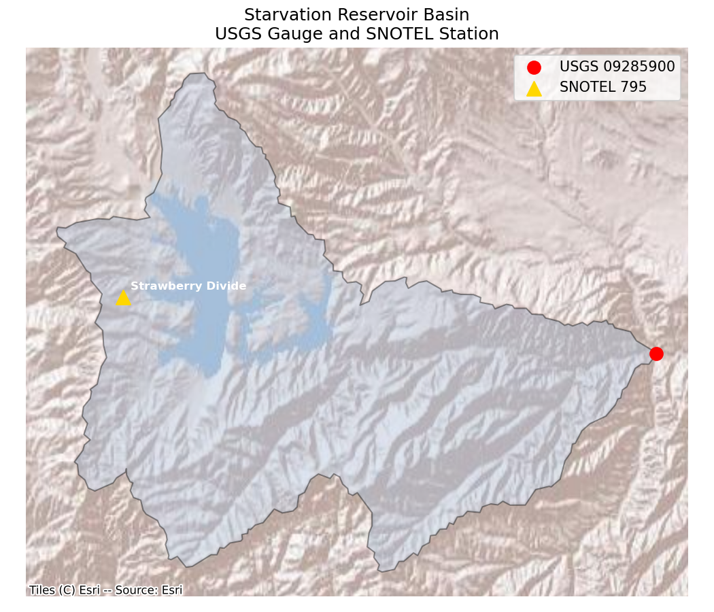

# HW2 - Starvation Reservoir Snowpack and Streamflow Analysis

This repository contains the data acquisition and analysis notebooks for a snowpack and streamflow assessment of the Starvation Reservoir basin in the Upper Colorado River Basin, Utah. The goal is to evaluate April 1, 2025 snowpack conditions at the Strawberry Divide SNOTEL station (795:UT:SNTL) and provide reservoir management recommendations based on expected spring and summer inflows to Starvation Reservoir.

The analysis uses historical SNOTEL snow water equivalent (SWE) data and USGS streamflow records for gauge 09285900 (Strawberry River at Pinnacles near Fruitland, UT) to characterize the historical range of snowpack and streamflow, compare WY2025 conditions to the historical median, and identify relationships between peak SWE and monthly inflow volumes for April through September.

## Repository Structure

- `HW2_Notebook1_DataAcquisition.ipynb` — Downloads and processes SNOTEL SWE and USGS streamflow data, delineates the watershed, and saves processed data to `data/`
- `HW2_Notebook2_Analysis.ipynb` — Loads processed data and generates all figures for the report
- `data/` — Processed CSV files (swe.csv, flow.csv, monthly.csv, peak_swe.csv)
- `figures/` — Output figures used in the report

## How to Reproduce

1. Clone this repository
2. Create the conda environment: `conda env create -f environment.yml`
3. Activate the environment: `conda activate hw2-reservoir`
4. Download the SNOTEL CSV manually (NRCS server blocked on CHPC) and save to `data/795_UT_SNTL.csv`:
   - https://wcc.sc.egov.usda.gov/reportGenerator/view_csv/customMultiTimeSeriesGroupByStationReport/daily/start_of_period/795:UT:SNTL%7Cid=%22%22%7Cname/1980-01-01,2025-09-30/WTEQ::value?fitToScreen=false
5. Run `HW2_Notebook1_DataAcquisition.ipynb` then `HW2_Notebook2_Analysis.ipynb`
